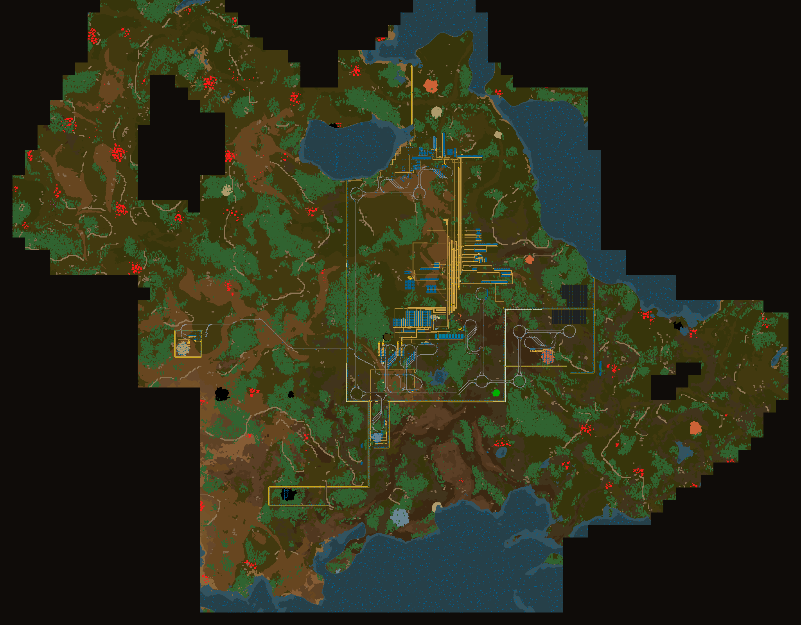
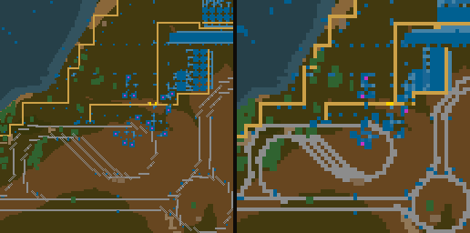

# Chartorio

A live web map for a Factorio headless server. Open a browser and watch your
world the way Dynmap works for Minecraft: terrain, ore, nests, trains, players,
pollution and map tags, updating while you play.

**No mod. Nobody installs anything.** Factorio has no concept of a server-only
mod, so Chartorio does not use one. The game code lives in the save's own
scenario script, which travels to clients with the map when they join. Your
players connect to a vanilla-compatible server and never see a checksum
mismatch.



*A running server's world: rail network, factory blocks, ore, nests in red, and
the ragged edge where the charted area stops.*

## What it shows

- **Terrain and factory** — tiles and entities in their real `map_color`, the
  same palette the in-game map uses, so it reads exactly like the map view.
  Rails are drawn along their own direction rather than as filled bounding
  boxes, so diagonals stay diagonal instead of turning into staircases
- **Ore patches** — hover one and the tooltip gives the whole patch's total,
  like the game does; oil reports a yield percentage instead of a count
- **Nests and worms** in enemy red, and **live biters** that appear only where
  radar or a player gives current vision
- **Players and trains** live, with train colour by state and click-to-follow.
  Positions arrive four times a second and the page interpolates between them,
  so movement is smooth without polling the game harder
- **Pollution** as a heat overlay, one value per chunk
- **Map tags** you placed in game, with their text
- **Alerts** — anything the player force loses, as a fading marker plus a feed
- **Legend** that highlights both ways: hover a legend row to spotlight that
  category on the map, or hover something on the map to light up its row

## The fog is honest

The map never shows you more than the game would.

| | shown when |
| --- | --- |
| terrain, factory, ore, nests | the chunk is **charted** |
| moving biters | the chunk is **currently visible** (radar or a player) |

Uncharted chunks are not merely hidden in the browser: the server refuses to
render them at all (`404 nothing charted here`). Set `CHARTORIO_FOG=open` if
you would rather have an all-seeing map.

## How it works

```
save/world/control.lua ──RCON──> bridge.py ──HTTP + SSE──> browser canvas
   (scenario script)              (stdlib only)             (no dependencies)
```

1. The **scenario script** answers custom commands over RCON. Custom commands,
   not `/silent-command`, so your save is never flagged as having used cheats.
   It rasters each chunk into palette indices and run-length encodes them.
2. The **bridge** is one Python file using only the standard library. It bakes
   those rasters into PNG tiles (hand-rolled encoder over `zlib`), caches them
   per chunk revision, builds zoomed-out tiles from them, and pushes live state
   to browsers over server-sent events.
3. The **web page** is one HTML file with no build step and no libraries.

Chunks are only re-rendered when the game reports them changed: build, mine and
chart events mark a chunk dirty, and the bridge drops that tile and every
zoomed-out tile above it.

**Nothing ever walks the whole map.** A played save holds tens of thousands of
chunks, and a world-wide scan does not fit inside an RCON round trip. The chunk
index, pollution and biters are all asked for per viewport, bounded server side,
and the browser re-asks as you pan.

### Zoom levels



*Left: sixteen native tiles. Right: the same area as one zoom-2 tile.*

One tile per chunk is fine at spawn and hopeless across a real base. Zoom
levels 1 to 3 combine 2×2, 4×4 and 8×8 chunks into one tile, built by halving
cached child tiles rather than asking the game again. At zoom 3 that is one
request instead of 64. Downscaling keeps palette colours exact rather than
averaging them, so hovering a zoomed-out tile still identifies what is under
the cursor, and it prefers a built thing over bare ground when merging four
pixels into one — otherwise a rail, being one tile wide, would vanish at every
zoom step.

## Requirements

- Factorio **2.0** headless server (the API names used here changed in 2.0)
- **Python 3.9+** on the same host — no packages, standard library only
- RCON enabled on the Factorio server, bound to localhost

## Install

```bash
git clone https://github.com/groenrick/chartorio.git
cd chartorio
sudo systemctl stop factorio          # the save is patched on disk
sudo ./install.sh                     # FACTORIO_DIR=/opt/factorio SAVE=.../world.zip
```

The installer copies the bridge, creates a `chartorio` service user, generates
an RCON password in `/etc/chartorio/rcon.env`, patches your save, and installs a
systemd unit. It prints the two RCON flags to add to your own Factorio unit; it
deliberately does not edit that unit for you.

Then open `http://your-server:8080`.

### Patching a save by hand

```bash
python3 tools/patch-save.py /opt/factorio/saves/world.zip
```

Stop the server first — a running Factorio holds the save in memory and would
write it straight back over your patch. The original is kept as
`world.zip.pre-chartorio`.

If your save uses a scenario other than freeplay, do not replace its
`control.lua`. Open `scenario/control.lua`, copy everything below the marker
line, and paste it at the end of your own scenario script instead.

## Configuration

All settings are environment variables on the bridge service.

| variable | default | meaning |
| --- | --- | --- |
| `RCON_PASSWORD` | required | must match the Factorio server |
| `RCON_HOST` / `RCON_PORT` | `127.0.0.1` / `27015` | where Factorio listens |
| `CHARTORIO_PORT` | `8080` | web port |
| `CHARTORIO_WEB` | auto | directory holding `index.html` |
| `CHARTORIO_STATE_INTERVAL` | `0.25` | seconds between player/train polls |
| `CHARTORIO_DIRTY_INTERVAL` | `2` | seconds between change and alert polls |
| `CHARTORIO_INDEX_INTERVAL` | `10` | seconds between map tag polls |
| `CHARTORIO_MAX_ZOOM` | `3` | zoomed-out levels to build |
| `CHARTORIO_TILE_CACHE` | `3000` | tiles kept in memory, per cache |
| `CHARTORIO_FOG` | `strict` | `open` renders uncharted chunks too |

## HTTP endpoints

| path | returns |
| --- | --- |
| `/` | the map page |
| `/events` | server-sent events: `state`, `tiles`, `index`, `tags`, `pollution`, `alerts` |
| `/state` | players, trains, tick |
| `/chunks?surface=&x1=&y1=&x2=&y2=` | charted chunks in a rectangle of **chunk** coordinates, with revisions, tile size and map seed |
| `/tile/<surface>/<z>/<x>/<y>.png` | a tile; `z` may be omitted for native |
| `/units?surface=&x1=&y1=&x2=&y2=` | biters inside a viewport, vision filtered |
| `/resource?surface=&x=&y=` | patch total under a point |
| `/pollution?surface=&x1=&y1=&x2=&y2=` | pollution per charted chunk in that rectangle |
| `/tags`, `/alerts` | map tags and recent losses |

## Limitations

- **One surface.** The UI is fixed to `nauvis`; the script already reports the
  full surface list, so this is UI work, not protocol work.
- **No authentication.** Anyone who can reach the port sees the map. Put it
  behind a reverse proxy or a VPN before exposing it.
- **Not the real art.** A headless server has no graphics and cannot take
  screenshots, so tiles are drawn from prototype map colours. If you want true
  rendered imagery you need a graphical Factorio install and a tool like
  [Mapshot](https://github.com/Palats/mapshot).
- Mods that add tiles or entities work fine; their colours come from their own
  prototypes.

## Why a scenario script instead of a mod

Factorio synchronises mods between server and clients: any mod with a
`control.lua` changes the checksum, so every player would have to install it.
Scenario scripts live inside the save and are sent to clients on join. That is
the whole trick, and it is why this works on a server people join casually.

Both routes disable achievements the same way, and neither marks the save as
having used cheat commands as long as you stay on custom commands.

## License

MIT. See [LICENSE](LICENSE).
