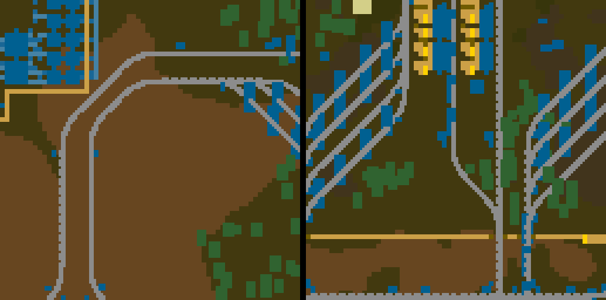
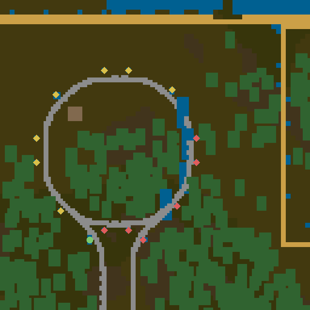

# Chartorio

A live web map for a Factorio headless server. Open a browser and watch your
world the way Dynmap works for Minecraft: terrain, ore, nests, trains, players,
pollution and map tags, updating while you play.

**No mod. Nobody installs anything.** Factorio has no concept of a server-only
mod, so Chartorio does not use one. The game code lives in the save's own
scenario script, which travels to clients with the map when they join. Your
players connect to a vanilla-compatible server and never see a checksum
mismatch.


*A running server's world: rail network, factory blocks, ore, nests in red, and
the ragged edge where the charted area stops.*

## What it shows

- **Terrain and factory** — tiles and entities in their real `map_color`, the
  same palette the in-game map uses, so it reads exactly like the map view.
  Rails are drawn between their real endpoints, curving through the point where
  their end tangents meet, rather than as filled bounding boxes, so track reads
  as track at any angle
- **Ore patches** — hover one and the tooltip gives the whole patch's total,
  like the game does; oil reports a yield percentage instead of a count
- **Nests and worms** in enemy red, and **live biters** that appear only where
  radar or a player gives current vision
- **Keyboard panning** with `wasd` or the arrow keys, `shift` to move faster,
  alongside dragging and scroll-to-zoom
- **Rail signals** with the state the game has on them right now: clear,
  reserved, blocked, and the four chain signal states. Round for a plain
  signal, diamond for a chain signal
- **Players and trains** live, with train colour by state and click-to-follow.
  Positions arrive four times a second; the page measures the real gap between
  updates and carries a train on with its own speed and heading until the next
  one lands, so a fast train moves smoothly instead of lurching
- **Pollution** as a heat overlay, one value per chunk
- **Map tags** you placed in game, with their text
- **Alerts** — anything the player force loses, as a fading marker plus a feed
- **Legend** that highlights both ways: hover a legend row to spotlight that
  category on the map, or hover something on the map to light up its row

## The fog is honest

The map never shows you more than the game would.

| | shown when |
| --- | --- |
| terrain, factory, ore, nests | the chunk is **charted** |
| moving biters | the chunk is **currently visible** (radar or a player) |

Uncharted chunks are not merely hidden in the browser: the server refuses to
render them at all (`404 nothing charted here`). Set `CHARTORIO_FOG=open` if
you would rather have an all-seeing map.

## How it works

```
save/world/control.lua ──RCON──> bridge.py ──WebSocket──> browser canvas
   (scenario script)              (stdlib only)            (no dependencies)
```

1. The **scenario script** answers custom commands over RCON. Custom commands,
   not `/silent-command`, so your save is never flagged as having used cheats.
   It rasters each chunk into palette indices and run-length encodes them.
2. The **bridge** is one Python file using only the standard library. It bakes
   those rasters into PNG tiles (hand-rolled encoder over `zlib`), caches them
   per chunk revision, builds zoomed-out tiles from them, and pushes live state
   to browsers over server-sent events.
3. The **web page** is one HTML file with no build step and no libraries. It
   opens a single WebSocket, tells the bridge which rectangle it is looking at
   and which layers are on, and receives only what changed. If the WebSocket
   cannot be established — some networks pass ordinary HTTP but refuse a plain
   `ws://` upgrade — it falls back to server-sent events on `/events`, which
   carries the same channels and the same viewport model.

### Load

The bridge asks the game for **nothing at all** while no browser is connected,
and each connected browser only causes work for the layers it has switched on
inside the rectangle it is showing. `/status` reports what the game is actually
being asked to do, including the share of wall time spent inside those calls.

Two things dominated that number before they were fixed, both worth knowing if
you extend this: searching a viewport for entities costs time proportional to
the **area**, not to what you find, so a screen-sized search for a handful of
signals was eating a third of the game thread. Rail signals never move, so they
are now kept in a per chunk registry and only their state is read. Biters do
move, but they are only searched for in chunks that are both on screen and
currently visible. Together that took the game thread share from 50% to 5% with
a browser open.

Chunk rasters are the heaviest single request, so they are rate limited
(`CHARTORIO_TILE_RATE`, eight per second by default): panning a map should
never turn into stutter in the game. Tiles carry an ETag, so a browser that
already holds one gets a 304 rather than the image again, and an empty server
is polled once a second instead of four times, since a paused game has nothing
moving to watch.

Chunks are only re-rendered when the game reports them changed: build, mine and
chart events mark a chunk dirty, and the bridge drops that tile and every
zoomed-out tile above it.

**Nothing ever walks the whole map.** A played save holds tens of thousands of
chunks, and a world-wide scan does not fit inside an RCON round trip. The chunk
index, pollution and biters are all asked for per viewport, bounded server side,
and the browser re-asks as you pan.

### Rails



*A turnout and a junction. Rails ask the game where they actually begin and
end, so curves bend through the point where their end tangents meet and joins
land exactly on the neighbouring track.*

### Rail signals



*Chain signals as diamonds, plain signals as circles, each filled with its
current state. Yellow is partly open, red is blocked, green is clear.*

A headless server has no graphics, so these are drawn rather than taken from
the game's own sprites. Shipping Factorio's art in this repository is not
something the licence allows, so the shapes follow how the two signal types
read apart in game instead.

### Zoom levels


*Left: sixteen native tiles. Right: the same area as one zoom-2 tile.*

One tile per chunk is fine at spawn and hopeless across a real base. Zoom
levels 1 to 3 combine 2×2, 4×4 and 8×8 chunks into one tile, built by halving
cached child tiles rather than asking the game again. At zoom 3 that is one
request instead of 64. Downscaling keeps palette colours exact rather than
averaging them, so hovering a zoomed-out tile still identifies what is under
the cursor, and it prefers a built thing over bare ground when merging four
pixels into one — otherwise a rail, being one tile wide, would vanish at every
zoom step.

## Requirements

- Factorio **2.0** headless server (the API names used here changed in 2.0)
- **Python 3.9+** on the same host — no packages, standard library only
- RCON enabled on the Factorio server, bound to localhost

## Install

```bash
git clone https://github.com/groenrick/chartorio.git
cd chartorio
sudo systemctl stop factorio          # the save is patched on disk
sudo ./install.sh                     # FACTORIO_DIR=/opt/factorio SAVE=.../world.zip
```

The installer copies the bridge, creates a `chartorio` service user, generates
an RCON password in `/etc/chartorio/rcon.env`, patches your save, and installs a
systemd unit. It prints the two RCON flags to add to your own Factorio unit; it
deliberately does not edit that unit for you.

Then open `http://your-server:8080`.

Longer version, including the optional sprite layer and what to do when
something is not working: **[docs/INSTALL.md](docs/INSTALL.md)**.

### Patching a save by hand

```bash
python3 tools/patch-save.py /opt/factorio/saves/world.zip
```

Stop the server first — a running Factorio holds the save in memory and would
write it straight back over your patch. The original is kept as
`world.zip.pre-chartorio`.

If your save uses a scenario other than freeplay, do not replace its
`control.lua`. Open `scenario/control.lua`, copy everything below the marker
line, and paste it at the end of your own scenario script instead.

## Configuration

All settings are environment variables on the bridge service.

| variable | default | meaning |
| --- | --- | --- |
| `RCON_PASSWORD` | required | must match the Factorio server |
| `RCON_HOST` / `RCON_PORT` | `127.0.0.1` / `27015` | where Factorio listens |
| `CHARTORIO_PORT` | `8080` | web port |
| `CHARTORIO_WEB` | auto | directory holding `index.html` |
| `CHARTORIO_STATE_INTERVAL` | `0.25` | seconds between player/train polls |
| `CHARTORIO_IDLE_STATE_INTERVAL` | `1` | seconds between those polls while nobody is in the game |
| `CHARTORIO_UNIT_INTERVAL` | `0.3` | seconds between biter polls, per viewer |
| `CHARTORIO_SIGNAL_INTERVAL` | `1` | seconds between signal polls, per viewer |
| `CHARTORIO_TILE_RATE` | `8` | chunk rasters per second, the cap that keeps panning from stuttering the game |
| `CHARTORIO_DIRTY_INTERVAL` | `2` | seconds between change and alert polls |
| `CHARTORIO_INDEX_INTERVAL` | `10` | seconds between map tag polls |
| `CHARTORIO_MAX_ZOOM` | `3` | zoomed-out levels to build |
| `CHARTORIO_TILE_CACHE` | `3000` | tiles kept in memory, per cache |
| `CHARTORIO_SPRITES` | unset | directory of real game sprites; see `render/README.md` |
| `CHARTORIO_SPRITE_SCALE` | `8` | screen pixels to a world tile before sprites are drawn |
| `CHARTORIO_FOG` | `strict` | `open` renders uncharted chunks too |

## HTTP endpoints

| path | returns |
| --- | --- |
| `/` | the map page |
| `/ws` | the WebSocket. The browser sends `{type: "viewport", ...}`; the server pushes `state`, `chunks`, `tiles`, `units`, `signals`, `tags`, `pollution`, `alerts` and `viewers` |
| `/events` | the same channels as `/ws` over server-sent events, used when a WebSocket cannot be established. Viewport comes from the query string and is updated through `/viewport` |
| `/status` | what the game is being asked to do: calls, rate, and game thread share |
| `/state` | players, trains, tick |
| `/chunks?surface=&x1=&y1=&x2=&y2=` | charted chunks in a rectangle of **chunk** coordinates, with revisions, tile size and map seed |
| `/tile/<surface>/<z>/<x>/<y>.png` | a tile; `z` may be omitted for native |
| `/units?surface=&x1=&y1=&x2=&y2=` | biters inside a viewport, vision filtered |
| `/signals?surface=&x1=&y1=&x2=&y2=` | rail signals inside a viewport, with their state |
| `/resource?surface=&x=&y=` | patch total under a point |
| `/pollution?surface=&x1=&y1=&x2=&y2=` | pollution per charted chunk in that rectangle |
| `/tags`, `/alerts` | map tags and recent losses |

## Real game art (optional)

Zoomed in past eight pixels to a world tile, the map can draw Factorio's actual
sprites instead of flat colours: belts pointing the right way and animating,
trees as themselves, ore thinning as it is mined, terrain textures underneath.
Zoomed out, and wherever there is no art for something, it falls back to the
colour map.

**The map is complete without this.** Colour tiles are the default and always
have been, they read like the in-game map view, and every feature works with
them. The sprite layer is an extra for people who have the game installed
somewhere, not a thing you are missing out on.

### Why you extract it yourself

**Factorio's artwork is Wube's, and this project does not ship it.** Chartorio
is MIT licensed, and that licence is ours to give over our own code — it is
emphatically not ours to give over Factorio's assets. So nothing extracted is
committed to this repository, attached to a release, or distributed in any
form. Every installation takes its own copy from its own licensed game.

It is the same reason [Mapshot](https://github.com/Palats/mapshot) works this
way. A mod sidesteps the problem by running inside the game, where the art
already is; a web map lives outside it and has to bring the art across.

A headless server ships **no artwork at all** — 872 KB of stubs against about a
gigabyte on a full install — so the extraction runs on a machine that has the
real game, which is usually not your server.

```bash
python3 render/sprites.py --out ./extract --only-from-map http://your-server:8080 …
python3 render/build.py  --in ./extract --out ./sprites --verify
```

Roughly 160 MB extracted, 48 MB after the build, for a typical world. Only the
prototypes your world actually contains are taken, so the cost follows how many
*kinds* of thing you have built rather than how big your map is.

Full steps, including the flags left out above, are in
[docs/INSTALL.md](docs/INSTALL.md#2-real-game-art-if-you-want-it).

## Limitations

- **One surface.** The UI is fixed to `nauvis`; the script already reports the
  full surface list, so this is UI work, not protocol work.
- **No authentication.** Anyone who can reach the port sees the map. Put it
  behind a reverse proxy or a VPN before exposing it.
- **Real art needs a one-off extraction.** Out of the box the map draws
  prototype colours, which is all a headless server can offer: it ships no
  artwork at all. Factorio's own sprites are an opt-in layer you extract from a
  graphical install of the game — see [Real game art](#real-game-art-optional).
- Mods that add tiles or entities work fine; their colours come from their own
  prototypes.

## Why a scenario script instead of a mod

Factorio synchronises mods between server and clients: any mod with a
`control.lua` changes the checksum, so every player would have to install it.
Scenario scripts live inside the save and are sent to clients on join. That is
the whole trick, and it is why this works on a server people join casually.

Both routes disable achievements the same way, and neither marks the save as
having used cheat commands as long as you stay on custom commands.

## License

MIT, over this project's own code. See [LICENSE](LICENSE).

**It does not cover Factorio's artwork or data.** Nothing from the game is
included in this repository. If you use the optional sprite layer you extract
that art from your own installed copy of Factorio, under Wube's terms, and it
stays on your own machines — see
[Real game art](#real-game-art-optional).
